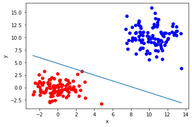
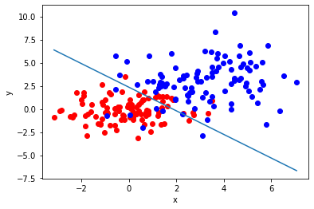
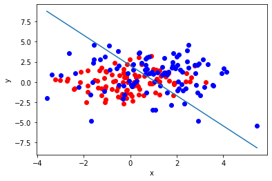
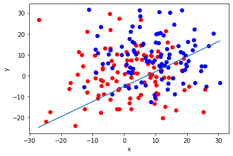
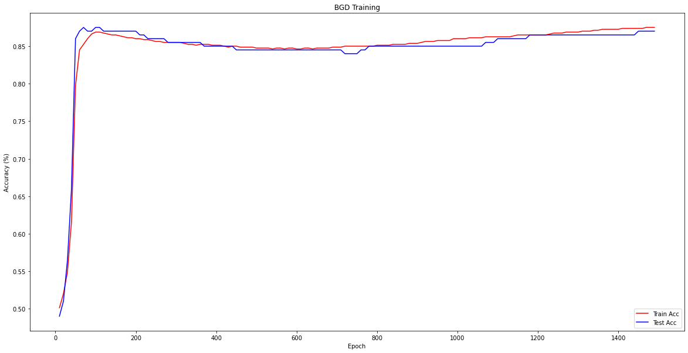
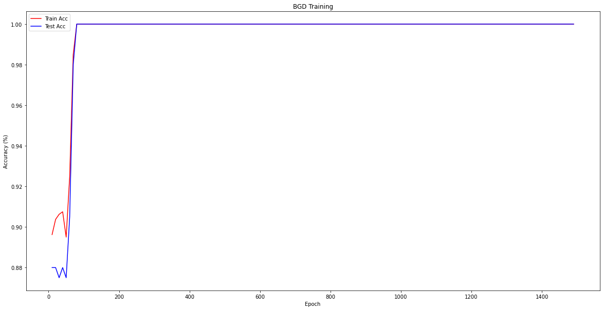

# Assignment 1 Report

刘仁杰 11911808

## 1. Part I: the perceptron

### Task 1.1 & 1.2 & 1.3

See `Part 1/perceptron.py` and `Part 1/main.py`  for task 1.1, 1.2 and 1.3 implementation.

### Task 1.4

We test the perceptron on four different dataset pairs in `Part 1/task4.ipynb` and plot the results.

* For the simplest case, where the two guassian datasets are set their mean to `[0, 0]` and `[10, 10]`, covariance matrix to `[[2, 0], [0, 2]]` and `[[3, 0], [0, 5]]` respectively, we can see that the perceptron perfectly seperate them with the accuracy being 100%.

* Then, we make these two datasets more closer by setting one of its mean to `[3, 3]`, this time the result shows that they are unlikely to be perfectly seperated with an overall accuracy being 90%.

* For the third case, we move them even closer by keeping their covariance matrix to be unchanged and change one of its mean to `[1, 1]`, this time the result shows that it is really difficult to seperated them with an overall accuracy reduced to ony 62.5%.

* With regard to the last case, we test how a high vaiance affects the percoptron performance. We make two guassian datasets with mean of `[0, 0]` and `[10, 10]` respectively and set their covariance matrix both to `[[100, 0], [0, 100]]`. The result shows that the accucarcy is also dramatically reduced to 45% due to the large overlapping area of the two datasets.

## 2. Part II: the mutli-layer perceptron

### Task 2.1 & 2.2

See `Part 2/mlp_numpy.py`, `Part 2/modules.py` and `Part 2/train_mlp_numpy.py` for task 2.1 and 2.2

### Task 2.3

Using the default values of the parameters and Batch Gradient Descent method, the accuracy curve of both training and testing data is shown below. See `Part 2/train_mlp_BGD.ipynb` for detail.

## 3. Part III: Sochastic Gradient Descent

### Task 3.1

See `Part 2/train_mlp_numpy.py` for task 3.1

### Task 3.2

Using the default values of the parameters and Sochastic Gradient Descent method, the accuracy curve of both training and testing data is shown below. From the result, we find that SGD method achieves a better performance and faster convergence than BGD. See `Part 2/train_mlp_SGD.ipynb` for detail.

## How to run the code?

* Task 1: `python main.py`, plots can be found in `task4.ipynb`.
* Task 2: `python train_mlp_numpy.py --optimizer=BGD`, plots can be found in `train_mlp_BGD.ipynb`.
* Task 3: `python train_mlp_numpy.py --optimizer=SGD`, plots can be found in `train_mlp_SGD.ipynb`.
