# Assignment 2 CNN & RNN

刘仁杰 11911808

## Part 1

### Task 1 & 2

> See Part1/task1_2.ipynb for running details.

#### Network & Hyper-parameter Configuration

Model & Loss Function: The Pytorch MLP is implemented with the same structure as the numpy version, containing 2 Linear layers with size (2,20) and (20,2) , respectively. ReLU is choosed as activation function and CrossEntropyLoss is used to compute gradient for backward.

Hyper-parameter: Stochastic gradient descent (SGD) is used to conduct gradient update on model parameter with `learning_rate=1e-2`. For SGD, the mini-batch size is set to 1. Both Pytorch and Numpy MLP run 200 epochs and are evaluated every 10 epochs.

Both models are trained and tested on the `make_moon`, `make_circles`, `make_classification` datasets.

#### Results on Make_moon Dataset

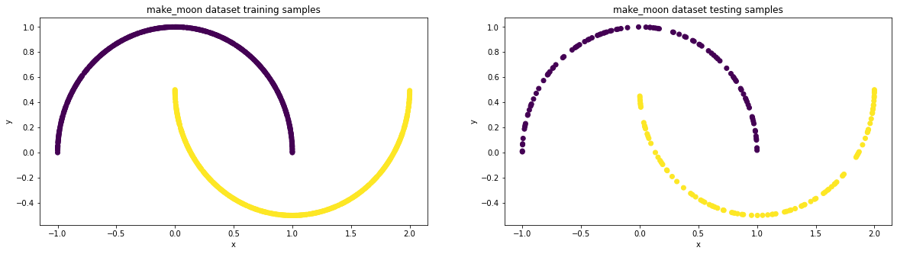

Samples generated from `make_moon` dataset are shown above. The left is for training while the right is for testing. Training and testing sets are splitted 80% and 20%, respectively.

Pytorch MLP:

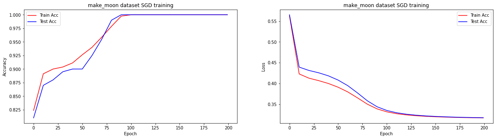

Figures above shows that pytorch MLP can achieve 100% accuracy on `make_moon` dataset.

Numpy MLP:

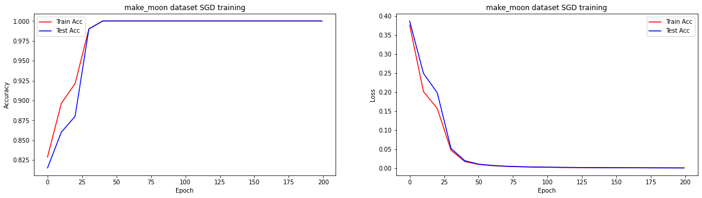

Figures above shows that numpy MLP can also achieve 100% accuracy on `make_moon` dataset.

Also, it can be seen that numpy MLP converges faster than pytorch mlp. Numpy MLP converges to100% accuracy at 50th epoch while pytorch MLP converges to 100% accuracy at 100th epoch.

#### Results on Make_circles Dataset

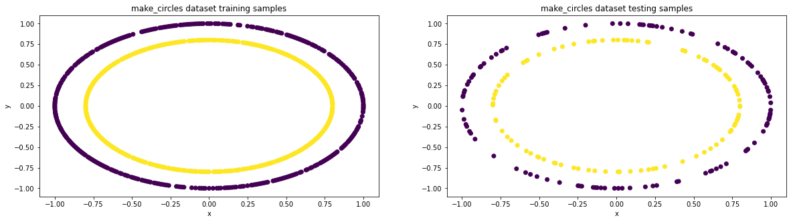

Samples generated from `make_circles` dataset are shown above. The left is for training while the right is for testing. Training and testing sets are splitted 80% and 20%, respectively.

Pytorch MLP:

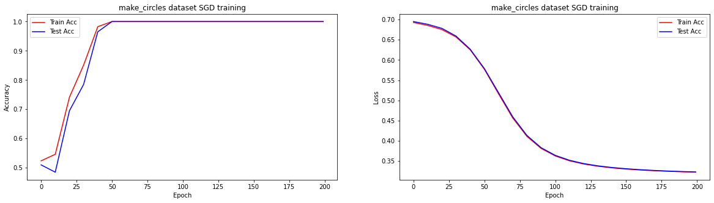

Reults show that pytorch MLP can achieve 100% accuracy on `make_circles` dataset.

Numpy MLP:

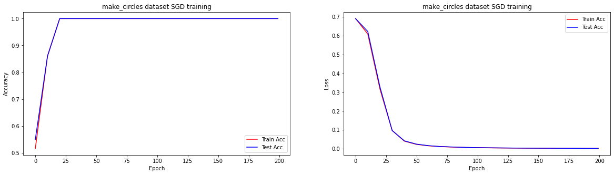

Reults show that numpy MLP can also achieve 100% accuracy on `make_circles` dataset.

Again, numpy MLP still converges faster than pytorch MLP. Numpy MLP converges to 100% accuracy at 25th epoch while pytorch MLP converges to 100% accuracy at 50th epoch.

#### Results on Make_classification Dataset

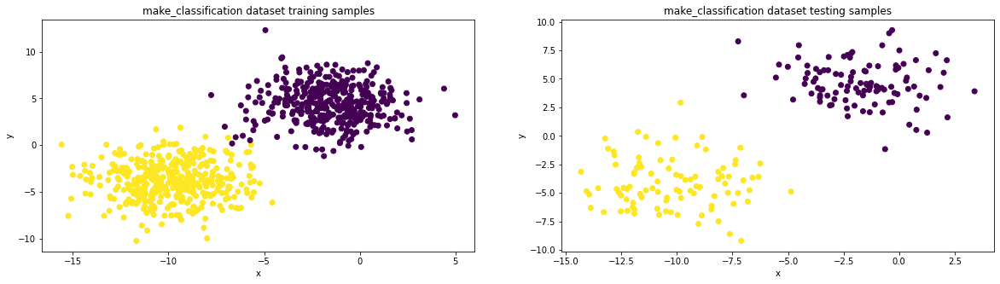

Samples generated in guassian distribution from `make_classification` dataset are shown above. The left is for training while the right is for testing. Training and testing sets are splitted 80% and 20%, respectively.

Pytorch MLP:

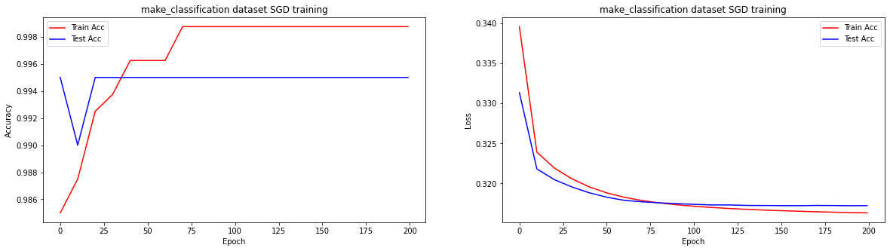

Reults show that on `make_circles` dataset, pytorch MLP achieves 99.85% accuracy on training set and 99.5% on testing set.

Numpy MLP:

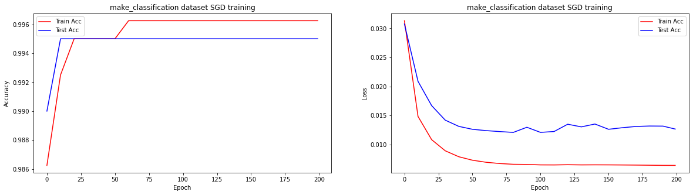

Reults show that on `make_circles` dataset, numpy MLP achieves 99.65% accuracy on training set and 99.5% on testing set.

Although pytorch MLP and numpy MLP has slight different of performance on training set (0.2%), they achieves the same performance on testing set (99.5%). And their converge speed is also almost the same, both converging at 75th epoch on training set.

### Task 3

> See Part1/task3.ipynb for running intructions.

#### Network & Hyper-parameter Configuration

Model & Loss Function: To train images of CIFAR10 using vanilla MLP structure, we need to first flatten the image which is of size (32 *32) and has 3 channels. That is, the input layer of CIFAR10 should be 32* 32 * 3 = 3072. Therefore, the Pytorch MLP for training CIFAR10 contains 2 Linear layers with size (3072,20) and (20,2) , respectively. ReLU is choosed as activation function and CrossEntropyLoss is used to compute gradient for backward.

Hyper-parameter: Stochastic gradient descent (SGD) is used to conduct gradient update on model parameter with `learning_rate=1e-2`. For SGD, the mini-batch size is set to 32, that is, we train 32 images and update the gradient at one time. The model runs 200 epochs and are evaluated every 10 epochs.

#### Resuls on CIFAR10 Dataset

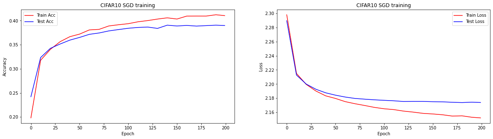

Resuls above shows that our pytorch MLP model gradually learns from the data samples as the accuracy curves continuous to increase and the loss curves continous to decrease, though the final performance on both training and testing test isn't that much satisfactory.

## Part 2

> See Part2/part2.ipynb for running instructions.

### Task 1. Model Implementation

The architecture  of the CNN network implemented here follows the slides at the end of the CNN lecture, which consists of 8 convolutional layers, 5 max pooling layers and 1 full-connect layer. The input is 3-channel image of size 32 *32. Kernel size, stride, padding, input channels and output channels of each convolutional layer are already given in slides, so we will not cover them here. For the size of each channel, given input of size N* N, we can get the output size of each channel as

$$
N_{out}=[(N_{in}−K+2P)/S]+1,
$$

where K is kernel size, P is padding size and S is stride.

### Task 2. Experiments

All experiments run 200 epochs and evaluate the model perfromance every 10 epochs.

* CNN with Adam optimizer and default learning rate 1e-4

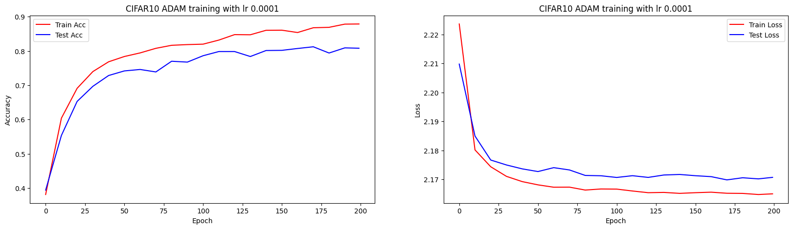

The model with Adam optimizer and lr 1e-4 shows a good performance on CIFAR for 200 epochs, which achieves 89% acc on training set and 80% acc on test set.

* CNN with Adam optimizer and a large learning rate 1e-2

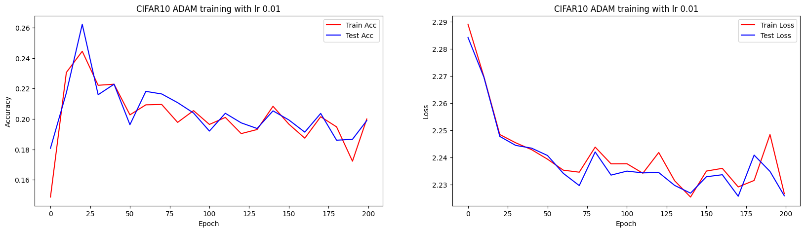

On the contracy, the model with Adam optimizer and a larger lr 1e-2 shows a bad performance on CIFAR for 200 epochs, which can not even converge and fluctuate unstably between 22% and 18% both on training set and test set. That is because the learning rate 1e-2 is too large, which makes the delta of gradient update too large to converge.

* CNN with Adam optimizer and a small learning rate 1e-6

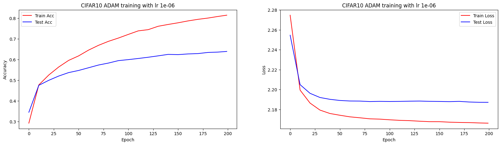

Interestingly, we can also observe that with Adam optimizer and a smaller lr 1e-6, the model get trained too slow. After 200 epochs' training, the train acc and test acc curves still have a quite obvious upward inclination, which indicates the model just dose not converge. That is because the learning rate is too small, making each gradient update moves only a very small step, thus slowing down the training process. Also, with a small learning rate, the training gets easier to be trapped into a local minima, incurring loss in general performance.

* CNN with SGD optimizer and default learning rate 1e-4

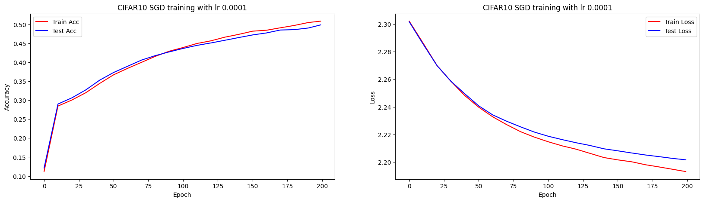

Resuls show that with SGD optimizer, the training process is slower compared with Adam. That is because SGD is uniformly scaled for each gradient update while Adam uses exponential moving average which will update model parameters with larger gradients at intial steps. So SGD is slower than Adam. However, since Adam is exponential moving averaged, it will fail to reach the global optima and has worse generalization performance than SGD. This can be implicitly indicated from the above figure by the almost same performance for SGD on both training and test set.

* CNN with Adagrad optimizer and default learning rate 1e-4

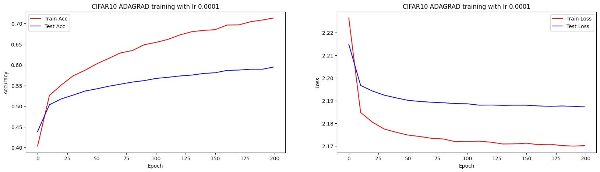

Results show that Adagrad optimizer converges slower than Adam optimizer. The model does not converge after 200 epochs. Additionally, The model performance is worst than Adam both on training and test set. These oberservations are because AdaGrad uses the second moment with no decay to conduct gradient update while Adam uses both first and second moments. So Adam will both train faster and better in performance, which is generaly the best choice.

## Part 3

> See Part3/part3.ipynb for running instructions.

### Task 1. Model Implementation

The detailed theoratical model structure is given in assignment instructions. Thus, the furmula description will not be covered in this report. The concrete implementation is shown as follows. The core of the RNN model is 3 linear layers ($W_{hx}$, $W_{hh}$ and $W_{ph}$ with size `input_dim` * 128, 128 * 128 and 128 * 10, respectively). In the forward pass, the current state input (a single number) and previous step's hidden state is passed as the paramter for computing the next step's hidden state and output of current state. We use `torch.nn.tanh()` and `torch.nn.softmax()` to express the $tanh$ and $softmax$ operations.

Moreover, `CrossEntropyLoss` is used to compute the loss. It implicitly includes a $softmax$ operator, so we will not explicitly call it in the model forward pass. Also, `RMSProp` optimizer is used as requied for tuning the weights.

### Task 2. Experiments on different lengths

All experiments run 10000 epochs with batchsize 128 and learning rate 1e-2 following the default configuration. The model performance is evaluated every 10 mini-batches. `torch.nn.utils.clip_grad_norm_` is used to retrict exploding gradients with the `max_norm` being set to 10.0.

* RNN training with input length equals to 5

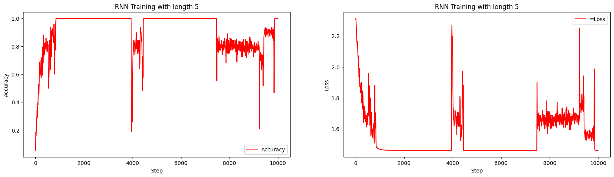

Results show that when input length is only 5, the model predicts the last digit of a palindrome pretty well (can achieve 100% accuracy) although with some outlier both for accuracy and loss.

* RNN training with input length equals to 10

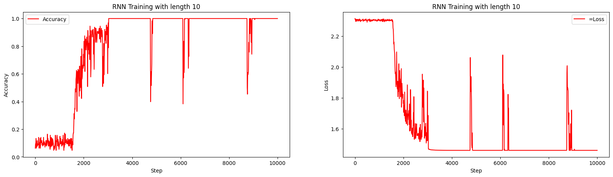

For the palindrome of input length 10, the vanilla RNN can also achieves 100% accuracy but with slower convergence speed. It converges at about 3000th step while for input length of 5, the model converges at about 1000th step.

* RNN training with input length equals to 15

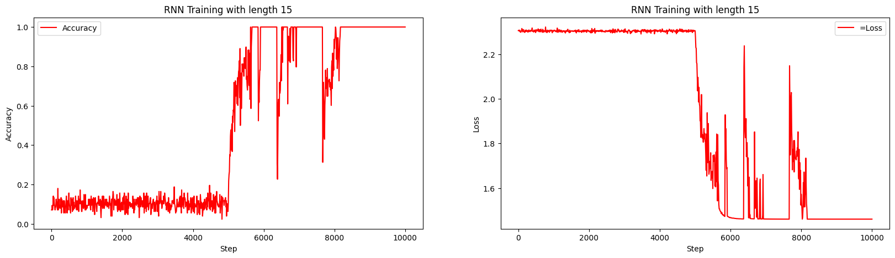

For the palindrome of input length 15, the vanilla RNN can stil achieves 100% accuracy after 10000 steps but also with slower convergence speed. It converges at about 5500th step, nearly 5.5x slower than that of input length 5.

* RNN training with input length equals to 20

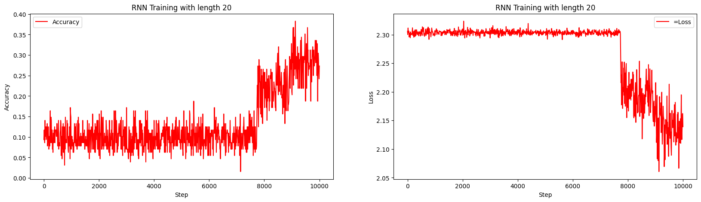

When the input length comes to 20, the vanilla RNN seems failing to take effect for predicting the last digit of a palindrome. It can only achieves 35% accuracy after 10000 steps and only get better after about 8000 steps, before which the average accuracy is only 10%. This is because the vanilla RNN is not able to store long term memory. As the input sequence goes longer along time, the infomation of several intial states gradually gets lost after many steps linear transformation.
