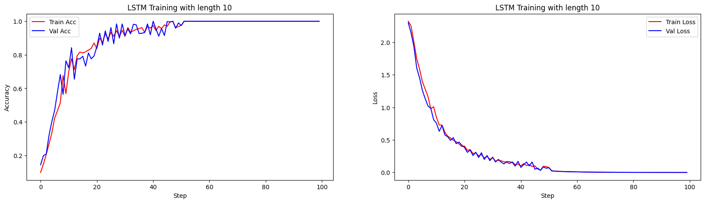

# Assignment 2 LSTM & GAN

刘仁杰 11911808

## Part 1. LSTM

### Task 1. LSTM Implementation

See `Part 1/lstm.py` for implementation of LSTM network architecture. The implementation follows the structure defined by the equations in `Assignment 3.pdf`, so we will not cover it here again. Also, as is required in `Assignment 3.pdf`, we initialise $h(0)$ and $c(0)$ to a vector of all zeros and compute the `CrossEntropyLoss` over the last time-step. We use `torch.nn.tanh()` and `torch.nn.softmax()` to express the $tanh$ and $softmax$ operations. However, since the `torch.nn.CrossEntropyLoss` implicitly includes a $softmax$ operator, so we will not explicitly call it in the model forward pass. Finally, we use `torch.optim.RMSprop` with learning rate being 1e-3 as optimizer to update model parameters.

### Task 2. Experiements

> See Part 1/task2.ipynb for running instructions.

We conduct four experiments with input sequence length being 5, 10, 15 and 20, seperately, and compare LSTM with vanilla RNN as is implemented and reported in Part 3 of the previous Assignment on the accruracy of the prediction. For the training, we randomly generate 2048 palindromes and split 80% of them as training dataset and 20% of them as validation dataset. We set batch size to be 128 for updating parameters. Each experiments run 100 epoches to reach convergence. The model performance is evaluated on validation dataset every epoch. `torch.nn.utils.clip_grad_norm_` is used to retrict exploding gradients with the `max_norm` being set to 10.0. For each experiment, the upper is the result of vanilla RNN and the latter is the results of LSTM.

* Accuracy & Loss comparison for input sequence length being 5

Analysis: We can see that both the vanilla RNN and LSTM can achieve 100% predict accuracy when input sequence length being 5. Also, LSTM converges faster.

* Accuracy & Loss comparison for input sequence length being 10

Analysis: We can see that training and validation accuray of the vanilla RNN continues to go up through out the 100 epoches. The accuracy nearly reaches 100% at 100th epoch, but the model does not converge. On the other hand, LSTM quickly converges at 50th epoch and achieves 100% predict accuracy.

* Accuracy & Loss comparison for input sequence length being 15

Analysis: We can see that the vanilla RNN performes badly when the input sequence length is 15 since it can not handle long-term memories. As a results, the vanilla RNN gets trained very slowly and finally only achieves 12% accuracy on validation dataset. On the contracy, since LSTM is better at memorying long-term sequence, it gets trained well, converges at about 60th epoch and achieves 100% accuracy on validation dataset.

* Accuracy & Loss comparison for input sequence length being 20

Analysis: Also, like the case for input sequence length being 20, the vanilla RNN just performes very badly while LSTM converges as expected and achieves perfect performance.

## Part 2. GAN

### Task 1. GAN Implementation

See `Part 2/my_gan.py` for implementation of Generator and Distriminator network architecture. When implementing those two networks, we follow the structure instructions provided in code annotation, thus we will not cover it here in report. To train the models, we follow the minimax strategy as shown in the report.

Specifically speaking, to update the generator, we first generate a random noise in latent space and feed it to the generator which then generate an artificial image. Then, we use the discriminator to make predictions on whether the images are fake or not. We use `CrossEntropyLoss` to generate the loss between the prediction results and true labels (labels that are all 1, i.e., all are true images, not artificial). Finally, the gradient are proporgated backward to update only the generator with the discriminator being fixed.

As for the discriminator, We directly make predictions on both the true images and artificial images and use `CrossEntropyLoss` to generate the loss with their coressponding labels (1 for true images and 0 for artificial images). After getting the loss, gradient are back proporgated only to the discriminator with the generated being fixed.

### Task 2. GAN Training

> Directly run Part 2/my_gan.py for model training.

For model training, we run 200 epoches with batch size being 64. We use `Adam` optimizer with learning rate being 2e-4 to update the model parameter. Latent space for the input of the generator is set to 100. We evaluate the model every 500 mini-batches and save the intermediate generated images for futher analysis. Generated artificial images throughout the training process is shown below.

* Generated artificial images at the start of the training:

Analysis: We can see that at the start of the training, the generator can only generate random noise images which can be easily distinguished as artificial images.

* Generated artificial images half way through the training:

Analysis: We can see at half way through the training, the generator can generate more realistic images that can be easily mis-recoginized as real images wriiten by hand.

* Generated artificial images at the end of the training:

Analysis: We can see that at the end of the training, the generator can generate pretty real images that are almost same with hand-written ones.

### Task 3. GAN Interpolation

For the interpolation, we first randomly generate two samples in latent space with latent dimension being 100 and see if the generated artificial images are of different classes. If they are of different classes, we Interpolate between these two samples by 7 different combinations of weighted average of the two noise, and generate an artificial image using each weighted average. The 7 interpolated images along with two images generated by initial samples are shown below. Reults show that for each weighted average of the two samples, the generator can generate a artificial hand-written images with good quality.

