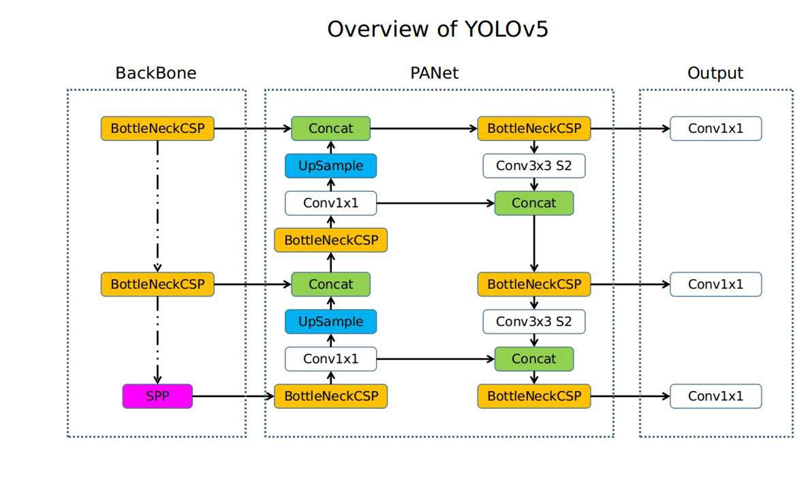
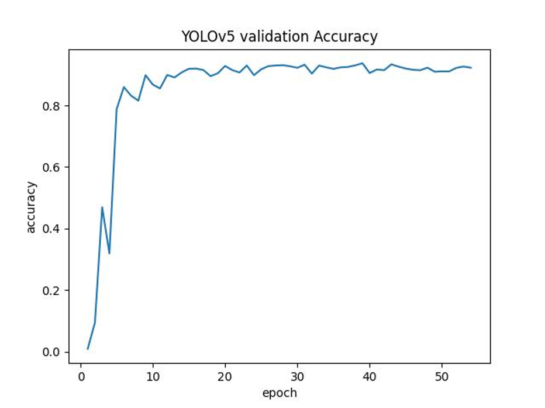
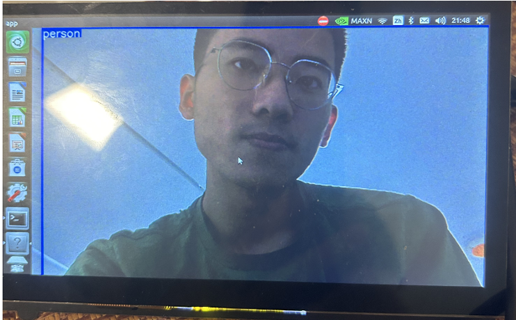

# CS324 Final Project Report

> 陈桂凡 11910503
> 葛兆宁 11911609
> 张庭境 11911919
> 刘仁杰 11911808

## Part 0. Project Overview

In this project, we successfully build and run YOLOv5 model inference on Jetson Nano Developer Kit. Results show that our trained model can successfully detect a person if someone appers in front of the camera. We display the detection result (raw image and target detection box in blue) on board and achieve a rate of about 2 to 3 fps for online image streams.

## Part 1. System Setup

### Hardware Drive and OS

First, we download the [Jetson Nano Developer Kit SD Card Image](https://developer.nvidia.com/jetson-nano-sd-card-image) and write the image to the microSD card by command line instructions using MacOS, accoding to instructions in [Jetson Nano Developer Kit Start Page](https://developer.nvidia.com/embedded/learn/get-started-jetson-nano-devkit#write).

Then, we plug the microSD card into the developer kit box and set up Ubuntu 18.04 when first booting.

### Software Environments and Packages

For the first attempt, we install conda-forge which is a community version of anaconda, create a new environment with python 3.9 and install necessary packages using `requirements.txt` provided by [YOLOv5](https://github.com/ultralytics/yolov5), with core packages such as opencv4.1.1, torch1.10.2 and matplotlib3.2.2. However, opencv shows green screen when capturing the images. We find out that the error is incurred by version conflict of gstreamer which is both installed in conda environment and system apt.

Then, we use back the system default python 3.6 with gstreamer in system apt packages and also install the same packages as requirements in python 3.6 enviroment. This time the opencv works normally and the environment is ready for model inference using pytorch.

## Part 2. Network for Person Detection

In this project, we choose YOLOv5 as the network for person detection. We look into the network structure in detail in fully understand the algorithm workflow, and alter the input output channels to adapt to inference on Jetson Nano Developer Kit.

### YOLOv5 Network Architecture

YOLOv5 network mainly consists of input terminal, Backbone, Neck and Prediction. This algorithm can be used to extract image features and make prediction.

### Analysis: Advantages

YOLOv5 is a widely used single-stage target detection algorithm with extremely fast reasoning speed and good accuracy, which is very suitable for the requirements of this project.

## Part 3. Model Training

For model training, we use a subset of labeled images from [COCO dataset](https://cocodataset.org/#home). COCO dataset is a large-scale object detection, segmentation, and captioning dataset, which has 330K images with over 200K being labeled with high quality and total 80 object categories. Since our task is only to recognize person, we just manually extract 1500 images labeled person form the 200K labels images and use them to train YOLOv5 model. The following training curve shows the accuracy under the mAP_0.5 metric.

The full name of IoU is Intersection over Union, which refers to the intersection area between the predicted content and the actual content divided by the sum of their areas. The full name of mAP is mean average precision. It means to evaluate the precision of each batch of pictures under test when the IoU is determined, and then take the average value of this batch of pictures. mAP_0.5 is a suitable measurement index for this project, which refers to the mAP when the IoU is at 50%.

The results demonstrates that the YOLOv5  learns well on the small datasets with 1500 images, which achieves an accuracy over 90%.

## Part 4. Person Detection on Jetson Nano

The procedure of person detection on Jetson nano can be roughly divided into three steps:

* We use opencv to fetch online image stream captured from the camera on board.
* For each frame of image stream, we use the trained YOLOv5 to detect whether there is a person.
* Display the detection box and original image together on the external display.

Results shows that we can successfully detect a person with a dectection rate of 2 to 3 fps:

In tests, people wearing masks or upside down can also be detected.
